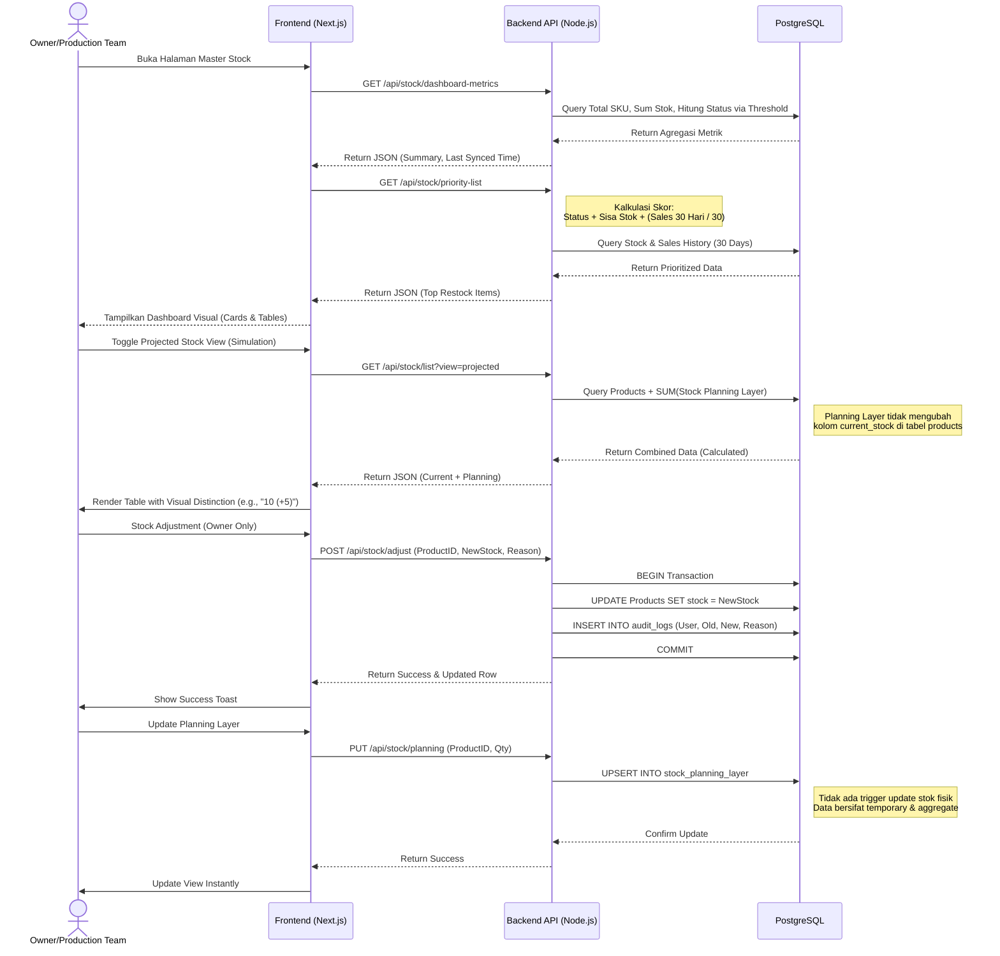
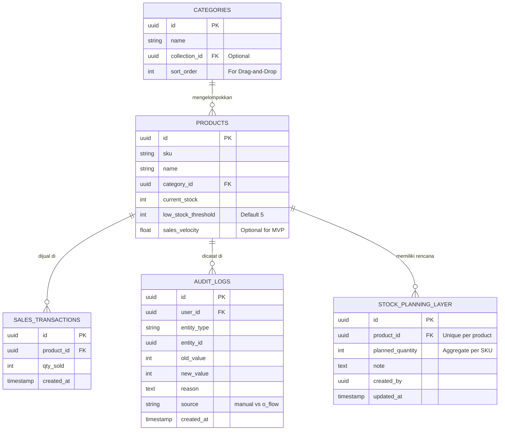

# PRD — Project Requirements Document

## 1. Overview
Saat ini, halaman "Master Stock" pada sistem O-SHE hanya berupa tabel data mentah dan tombol *export*. Hal ini menyulitkan *Owner* dan Tim Produksi untuk memantau kesehatan stok secara cepat, mengambil keputusan, serta mengelola data master (kategori) dan koreksi stok tanpa berpindah modul. Selain itu, tidak adanya visibilitas terhadap rencana stok yang akan datang menyebabkan perencanaan produksi sering kali tidak akurat karena bergantung pada catatan manual di luar sistem (kertas/Excel terpisah).

Proyek ini bertujuan untuk **meningkatkan (enhance)** halaman Master Stock menjadi sebuah *dashboard* interaktif dan pusat manajemen operasional ringan. Tujuan utamanya adalah agar pengguna dapat membuka halaman tersebut dan dalam hitungan detik langsung mengetahui metrik utama (Total SKU, stok menipis, stok habis), mengetahui secara pasti produk mana yang harus diproduksi ulang lebih dulu melalui fitur **Restock Priority**, mengelola kategori produk secara efisien tanpa interrupt workflow, melakukan koreksi stok cepat dengan audit trail yang jelas, serta memanfaatkan lapisan **Perencanaan Stok (Planning Layer)** untuk menghitung proyeksi ketersediaan stok di masa depan (*Projected Stock*) tanpa mengubah data fisik aktual hingga saatnya diterima melalui modul O-FLOW.

## 2. Requirements
- **Integrasi Seamless:** Pembaruan ini harus terintegrasi dengan mulus ke dalam sistem O-SHE yang sudah ada (bukan membuat ulang aplikasi dari nol).
- **Performa & Data Freshness:** Data ditampilkan secara *real-time* atau mendekati *real-time*. Tampilan harus mencakup penanda waktu pembaruan data terakhir (*"Last synced: X mins ago"*) untuk memberikan konteks relevansi data.
- **Logika Prioritas Otomatis:** Sistem harus mampu mengkalkulasi prioritas *restock* secara otomatis yang mempertimbangkan status kritis, kecepatan penjualan, dan rencana stok masuk (*planning layer*).
- **Logika Sales Velocity (Revisi):**
    - Perhitungan kecepatan penjualan berbasis data **30 hari terakhir**.
    - Rumus: `(Total Qty Sold dalam 30 Hari) / 30 = Rata-rata Penjualan Harian`.
    - Data ini menjadi dasar penentuan mana produk yang harus didahulukan jika stok sama-sama menipis.
- **Threshold Dinamis:** Ambang batas (*threshold*) peringatan stok tidak disamaratakan, melainkan bisa diatur secara spesifik untuk setiap SKU (default: 5 pcs).
- **Filtered Export:** Fitur *Export* (Excel/CSV) yang sudah ada harus ditingkatkan agar mendukung ekspor data sesuai filter aktif (misalnya: hanya download item "Out of Stock").
- **Kontrol Paginasi & Kepadatan:** Pengguna harus dapat mengatur jumlah baris data yang ditampilkan per halaman (10, 25, 50) secara *real-time* tanpa reload halaman penuh, dengan preferensi yang tersimpan untuk sesi berikutnya.
- **Manajemen Kategori Terpusat & Inline:**
    - Pengguna dapat membuat kategori baru secara *inline* saat menambah/mengedit produk.
    - Terdapat halaman/modal khusus "Manage Categories" untuk pengelolaan struktur, termasuk pengurutan ulang (*drag-and-drop*).
    - Urutan kategori harus persisten dan mempengaruhi tampilan filter serta hasil export.
- **Stock Adjustment & Audit Trail:**
    - Pengguna berwenang dapat menyesuaikan stok langsung dari halaman Master Stock.
    - Setiap penyesuaian wajib mencatat alasan, pengguna, waktu, dan nilai sebelum/sesudah (Audit Log).
    - Pembatasan akses berdasarkan peran (RBAC): Hanya Owner/Admin yang bisa adjust stok.
- **Temporary Planning Layer & Projected Visibility:**
    - Sistem harus memungkinkan pencatatan rencana stok masuk (*Incoming Plan*) yang bersifat simulasi sementara.
    - Data simulasi ini **tidak mempengaruhi** stok fisik utama di database produk secara langsung.
    - Pengguna dapat beralih tampilan antara "Stok Aktual" dan "Stok Proyeksi (Simulasi)".
    - Perhitungan proyeksi bersifat dinamis: `Stok Aktual + Rencana Incoming (Simulasi)`.
    - Modul O-FLOW tetap menjadi satu-satunya Sumber Kebenaran (*Source of Truth*) untuk stok fisik aktual.
    - Data Planning Layer disimpan dalam bentuk agregat per produk (total rencana per SKU) untuk kesederhanaan MVP.
    - Visualisasi menggunakan format: `Stok Aktual (+Rencana)`, contoh: `10 (+5)`.
- **Keamanan Data:** Validasi diperlukan untuk mencegah duplikasi nama kategori dan memastikan integritas data stok saat adjustment. Data simulasi harus dapat di-reset atau diedit tanpa dampak pada data historis transaksi.

## 3. Phasing (MVP vs Future)
Untuk menjaga fokus pengembangan dan dampak operasional, fitur dibagi menjadi dua fase:

### Fase 1: MVP (Minimum Viable Product)
Fokus pada visibilitas data, manajemen dasar, usability tabel, dan alat perencanaan stok dasar.
- **Dashboard Summary Cards:** 4 kartu metrik (Total SKU, Total Pcs, Low Stock, OOS) dengan fungsi klik filter.
- **Visual Status Indicators:** Label warna (Hijau, Kuning, Merah) pada tabel utama.
- **Basic Restock Priority:** Urutan prioritas berdasarkan Level Stok + Data Velocity Dasar.
- **Quick Filters:** Filter sederhana berdasarkan Kategori dan Status.
- **Export dengan Filter:** Fitur download laporan sesuai tampilan yang sedang difilter user.
- **Pagination & Row Density Control:** Opsi pengaturan jumlah baris per halaman (10, 25, 50) dengan default 10, tersimpan di *local storage*.
- **Inline Category Creation:** Ability to add new category without leaving the product form.
- **Quick Stock Adjustment:** Manual stock correction with Reason input & Audit Log.
- **RBAC for Adjustment:** Restrict stock adjustment to Owner/Admin roles.
- **Temporary Incoming Planning:** Ability to add simulated incoming stock quantity per product for planning purposes (aggregate data per SKU).
- **Projected Stock View Toggle:** Switch to view Current vs Projected Stock (Simulation) on the main table with global visual indicator.
- **Projected Stock Visualization:** Display format "Actual (+Plan)" e.g., "10 (+5)" with secondary color for planned quantity.
- **Edit/Reset Planning Data:** Ability to modify or clear simulated incoming data without affecting physical stock.
- **Priority Context Indicator:** Show visual hint when stock is low but planning data covers the shortage.

### Fase 2: Future Enhancements
Fokus pada otomatisasi lanjutan dan manajemen struktur kompleks.
- **Dynamic Sales Velocity:** Kalkulasi otomatis *real-time* berdasarkan riwayat transaksi sales (tanpa input manual).
- **Direct Production Action:** Tombol "Add to Production List" untuk mengirim item prioritas langsung ke modul produksi/manufaktur.
- **Advanced Category Ordering:** Drag-and-Drop interface untuk mengurutkan kategori dalam Collection secara visual dan kompleks.
- **User-Specific Views:** Tampilan khusus *Owner* (Fokus pada nilai aset & risiko keuangan) vs *Production* (Fokus pada list eksekusi harian).
- **Adjustment Analytics:** Laporan khusus mengenai sejarah penyesuaian stok untuk audit keuangan.
- **Automated Planning Sync:** Integrasi status planning layer dengan Purchase Order (PO) sistem jika ada (mengubah simulasi menjadi komitmen nyata).
- **Planning Layer Analytics:** Laporan historis mengenai akurasi perencanaan vs realisasi stok masuk.

## 4. Core Features

### A. Dashboard Summary Cards (Clickable)
4 kartu informasi di bagian atas halaman yang menampilkan angka *real-time*:
1.  **Total SKU:** Jumlah total varian produk aktif.
2.  **Total Stock Pcs:** Total unit fisik yang tersedia.
3.  **Low Stock:** Jumlah item di bawah threshold.
4.  **Out of Stock:** Jumlah item dengan stok 0.
*Interaksi:* Mengklik kartu *Low Stock* atau *Out of Stock* akan otomatis memfilter tabel di bawahnya.
*Perspektif Owner:* Kartu ini memberikan indikasi kesehatan aset (risiko kehabisan barang vs uang tertanam di stok).

### B. Visual Status Indicators
Label warna visual pada tabel untuk setiap baris produk:
- 🟢 **Healthy:** Stok > Threshold (Aman).
- 🟡 **Low Stock:** 0 < Stok ≤ Threshold (Perlu Perhatian).
- 🔴 **Out of Stock:** Stok = 0 (Kritis).

### C. Restock Priority Section
Sebuah daftar "Top Priority" di bagian atas tabel (Top 5-10) yang menggunakan **Weighted Scoring Logic**:
- **Rumus Skor Prioritas:**
  `(Bobot Status * 50%) + (Bobot Sisa Stok * 30%) + (Bobot Sales Velocity * 20%)`
  - *Status:* Out of Stock = Nilai Tertinggi (100), Low Stock = Nilai Menengah (50), Healthy = 0.
  - *Sisa Stok:* Stok paling sedikit mendapatkan poin tertinggi.
  - *Velocity:* Produk dengan penjualan harian rata-rata lebih tinggi mendapatkan poin lebih tinggi.
- **Tujuan:** Memastikan produk yang "Laris tapi Habis" muncul paling atas, bukan produk "Jarang Lari dan Habis".
- **Planning Consideration:** Prioritas tetap berdasarkan stok fisik, namun jika terdapat data Planning Layer yang signifikan (misal: stok 0 tapi ada rencana masuk 50), sistem menampilkan indikator konteks seperti "⏳ Dalam Proses Pemenuhan" agar pengguna memahami bahwa kebutuhan tersebut sedang dalam jalur pemenuhan.

### D. Direct Action (Actionable Insights)
Memungkinkan user bertindak langsung dari dashboard:
- **Add to Production List:** Tombol aksi pada baris prioritas untuk menandai item sebagai "Siap Produksi".
- **Export Priority List:** Tombol khusus untuk mengunduh *hanya* daftar item prioritas tersebut (bukan seluruh tabel).
- **Perspektif Production:** Menggunakan fitur ini untuk menyusun antrian kerja harian.

### E. Quick Filters & Search
- Filter satu kali klik untuk menampilkan Kategori tertentu atau Status Stok (All, Healthy, Low, OOS).
- Pencarian teks untuk nama produk/SKU.
- **Category Order:** Filter kategori ditampilkan sesuai urutan yang diatur di "Manage Categories".

### F. Custom SKU Threshold Setting
Pilihan untuk mengedit angka batas *low stock* per item per SKU (misal: ubah dari default 5 menjadi 20 untuk produk *fast-moving*).

### G. Pagination & Row Density Control
Fitur navigasi tabel di bagian bawah yang memungkinkan pengguna mengelola volume data yang ditampilkan:
- **Opsi Baris Per Halaman:** Dropdown pilihan dengan opsi **10, 25, dan 50** data.
- **Default Setting:** Sistem secara default menampilkan **10 data per halaman** saat pertama kali diakses untuk menjaga keterbacaan dan performa awal.
- **Real-time Update:** Perubahan jumlah baris per halaman harus terjadi secara instan (*client-side rendering*) tanpa melakukan reload halaman penuh (*full page reload*).
- **Persistent Preference:** Pilihan pengguna harus disimpan menggunakan **Local Storage** browser. Ketika pengguna kembali ke halaman Master Stock, sistem harus otomatis memuat preferensi jumlah baris terakhir yang dipilih.
- **Navigasi Pagination:** Tombol *Previous*, *Next*, dan nomor halaman yang menyesuaikan secara otomatis berdasarkan total data dan jumlah baris per halaman yang aktif.
- **Smart Page Adjustment:** Jika user berada di Halaman 5 (dengan 10 baris/halaman) lalu mengubah pengaturan menjadi 50 baris/halaman, sistem harus secara logis menyesuaikan posisi halaman (misal: mengarahkan ke Halaman 1 atau 2 yang paling mendekati) untuk menghindari error "Page Not Found".

### H. Category Management (Inline & Centralized)
Fitur untuk mengelola struktur kategori agar tetap rapi dan relevan:
- **Inline Creation:** Saat menambahkan atau mengedit produk, jika kategori yang diinginkan belum ada, user dapat mengetik nama baru dan memilih "Create New Category". Sistem akan memvalidasi nama (cek duplikasi) dan menyimpannya tanpa reload halaman.
- **Manage Categories Modal/Page:** Halaman khusus untuk melihat daftar semua kategori dan collection.
- **Drag-and-Drop Reordering:** User dapat mengubah urutan kategori dalam sebuah collection. Urutan ini disimpan di backend (`sort_order`) dan mempengaruhi:
    - Urutan tampilan pada dropdown filter di Master Stock.
    - Urutan pengelompokan pada file Export (Excel/PDF).
- **Validation:** Mencegah penghapusan kategori yang masih digunakan oleh produk aktif (harus re-assign dulu).

### I. Quick Stock Adjustment & Audit
Fitur untuk koreksi stok cepat langsung dari tabel Master Stock:
- **Action Button:** Ikon "Adjust" pada setiap baris produk (hanya terlihat untuk role Owner/Admin).
- **Adjustment Modal:** Popup untuk memasukkan jumlah stok baru atau jumlah penyesuaian (+/-).
- **Mandatory Reason:** Field wajib diisi yang menjelaskan alasan perubahan (misal: "Stock Opname", "Barang Rusak", "Koreksi Input").
- **Audit Logging:** Sistem mencatat:
    - `User ID` siapa yang mengubah.
    - `Timestamp` waktu perubahan.
    - `Old Value` (Stok Sebelum).
    - `New Value` (Stok Sesudah).
    - `Reason` (Alasan).
- **Differentiation:** Log adjustment ini ditandai sebagai "Manual Adjustment" untuk membedakan dengan "Transaction Movement" dari modul O-FLOW.
- **Feedback:** Notifikasi Toast (Success/Error) muncul segera setelah aksi dilakukan.
- **RBAC:** Role 'Production' hanya dapat melihat data stok, tidak dapat melakukan adjustment.

### J. Temporary Planning Layer & Projected Stock View
Fitur untuk simulasi perencanaan stok yang akan datang tanpa mengubah data fisik aktual.

- **View Toggle Switch:** Tombol toggle di atas tabel utama untuk beralih antara mode **"Current Stock"** (Default/Aktual) dan **"Projected Stock (Simulation)"**.
- **Global Visual Indicator:** Saat mode "Projected" aktif, terdapat indikator visual global (misal: banner atau badge berwarna biru muda di header tabel) yang menandakan pengguna sedang melihat data simulasi untuk menjaga kesadaran konteks.
- **Projected Logic:**
    - Saat mode "Projected" aktif, kolom stok menampilkan kalkulasi dinamis: `Stok Fisik + Total Incoming Plan (Simulasi)`.
    - **Format Visual:** `10 (+5)` di mana 10 adalah stok fisik dan +5 adalah rencana simulasi.
    - **Warna:** Angka stok fisik ditampilkan dengan warna utama (hitam/abu tua), sedangkan angka rencana simulasi diberikan warna sekunder (biru muda atau abu-abu) untuk membedakan dari stok fisik sesuai prinsip desain minimalis.
    - Stok fisik tetap menjadi nilai utama yang ditampilkan, sementara nilai perencanaan adalah informasi tambahan sekunder.
- **Planning Data Entry:**
    - Tombol "Add Plan" pada baris produk (akses Owner/Admin/Production Lead).
    - Input: Jumlah Qty Rencana (agregat per produk), Catatan (opsional).
    - Sifat Data: **Temporary & Editable**. Data ini disimpan untuk keperluan tampilan proyeksi, namun tidak mengunci status.
    - Data disimpan dalam bentuk agregat per produk untuk menjaga kesederhanaan penggunaan dan performa sistem pada Fase 1.
- **Edit & Reset Capability:**
    - Pengguna dapat mengedit jumlah rencana incoming kapan saja.
    - Pengguna dapat mereset/menghapus seluruh data rencana incoming untuk produk tertentu tanpa mempengaruhi stok fisik.
    - Tidak ada workflow "Confirm Receipt". Perpindahan ke stok fisik hanya terjadi melalui modul O-FLOW (Source of Truth).
    - Data Planning Layer bersifat sementara, dapat diperbarui, dihapus, atau di-reset kapan saja sesuai kebutuhan.
- **Priority Context Integration:**
    - Restock Priority tetap menggunakan stok aktual sebagai dasar utama perhitungan.
    - Jika terdapat data Planning Layer yang secara signifikan dapat menutupi kekurangan stok (misal: stok 0 tapi ada rencana 50), sistem memberikan indikator tambahan pada baris prioritas (misal: icon atau label "Dalam Pemenuhan").
    - Hal ini membantu pengguna memahami bahwa kebutuhan tersebut sedang dalam proses pemenuhan tanpa mengubah skor prioritas dasar.
- **Operational Goal:** Menggantikan catatan manual/print-out produksi dengan alat simulasi digital terpusat untuk perencanaan yang lebih akurat. Seluruh proses perencanaan dan simulasi stok dapat dilakukan secara langsung di dalam sistem dengan lebih cepat, fleksibel, dan mudah dipahami.

## 5. User Flow
1.  **Masuk ke Modul:** Pengguna *login* ke O-SHE dan membuka menu "Master Stock".
2.  **Cek Freshness Data:** User melihat label *"Last synced: 5 mins ago"* untuk memastikan data valid.
3.  **Review Cepat:** User melihat Dashboard Summary (Owner fokus pada risiko OOS, Production fokus pada jumlah Low Stock).
4.  **Analisis Prioritas & Planning:**
    - Tim Produksi melihat bagian "Restock Priority".
    - User mengaktifkan Toggle **"Projected Stock (Simulation)"**.
    - Sistem menampilkan indikator visual global bahwa mode simulasi aktif.
    - Tabel menampilkan format `Stok Aktual (+Rencana)`, contoh: `0 (+50)`.
    - User menyadari bahwa meskipun stok fisik 0, ada rencana incoming 50 pcs yang dicatat sebagai simulasi, sehingga prioritas produksi dapat disesuaikan dengan konteks bahwa kebutuhan sedang dalam proses pemenuhan.
5.  **Pengaturan Tampilan Tabel (Usability):**
    - User ingin melihat lebih banyak data sekaligus. User mengubah opsi pagination dari "10" menjadi "50" per halaman.
    - Tabel langsung memperbarui tampilan tanpa reload. Preferensi "50" tersimpan untuk kunjungan berikutnya.
6.  **Manajemen Kategori (Inline):**
    - User menambah produk baru. Kategori yang dibutuhkan belum ada.
    - User mengetik nama kategori baru di dropdown, memilih "Create New", sistem menyimpan kategori dan melanjutkan simpan produk tanpa interrupt.
7.  **Stock Adjustment (Koreksi):**
    - Owner menemukan selisih stok fisik.
    - Owner klik ikon "Adjust" pada baris produk.
    - Input selisih dan alasan ("Stock Opname Bulan Ini").
    - Sistem update stok fisik, catat audit log, dan tampilkan notifikasi sukses.
8.  **Recording Planning Data (Simulasi):**
    - Production Lead menerima informasi dari pengrajin bahwa 20 pcs kemeja akan selesai minggu depan.
    - User klik "Add Plan" pada produk terkait, input 20 pcs sebagai rencana (data agregat per produk).
    - Tabel Master Stock (mode Projected) langsung menunjukkan penambahan `+20` secara visual dengan warna sekunder.
    - *Catatan:* Stok fisik di database produk tidak berubah. Data bersifat temporary dan dapat di-edit/di-reset kapan saja.
9.  **Tindak Lanjut:**
    - Jika butuh laporan fisik, User menekan "Export". Karena filter "Out of Stock" masih aktif, file Excel yang terunduh hanya berisi item yang habis (Filtered Export).
    - Urutan kategori di dalam export mengikuti urutan yang diatur di "Manage Categories".
    - Jika barang benar-benar tiba, user melakukan proses penerimaan resmi di modul **O-FLOW**, yang akan memperbarui stok fisik secara permanen. User kemudian dapat mereset data simulasi di Master Stock.
10. **Penyesuaian:** User mengedit *threshold* pada produk tertentu untuk mencegah peringatan palsu di masa depan.

## 6. UX & Edge Cases
Untuk memastikan pengalaman pengguna yang mulus meskipun data tidak ideal:

- **Empty State (No Results):**
    - Jika pencarian/filter tidak menemukan hasil: Tampilkan ilustrasi kosong dengan teks "Tidak ada produk yang cocok dengan filter ini." dan tombol "Clear Filter".
- **All Stocks Healthy (Positive Edge Case):**
    - Jika tidak ada item Low Stock atau Out of Stock: Dashboard Summary menunjukkan angka 0 untuk kategori kritis.
    - Bagian "Restock Priority" dapat menampilkan pesan: "🎉 Semua stok aman! Tidak ada prioritas restock mendesak saat ini."
- **Data Freshness Warning:**
    - Jika data belum ter-update lebih dari 1 jam (misal due to sync issue), tampilkan peringatan visual berwarna oranye: "Data mungkin kedaluwarsa. Last synced: 2 hours ago."
- **Zero Velocity:**
    - Jika produk belum pernah terjual (Velocity = 0), sistem tidak boleh *error*. Produk ini harus diberi skor prioritas rendah meskipun stoknya sedikit (karena tidak mendesak dijual kembali).
- **Pagination Logic Adjustment:**
    - Jika user berada di Halaman 5 (dengan 10 baris/halaman) lalu mengubah pengaturan menjadi 50 baris/halaman, sistem harus secara logis menyesuaikan posisi halaman.
    - *Skenario:* Jika total data 100, Halaman 5 dari 10 baris = item 41-50. Jika diubah ke 50 baris, total halaman jadi 2. User sebaiknya diarahkan ke Halaman 1 (item 1-50) atau Halaman 2 (item 51-100) yang paling mendekati posisi sebelumnya, untuk menghindari kesalahan "Page Not Found".
- **Category Duplicate Validation:**
    - Jika user mencoba membuat kategori inline dengan nama yang sudah ada, sistem harus menolak dan menyarankan kategori yang sudah ada (Auto-complete), bukan membuat duplikat.
- **Stock Adjustment Permission:**
    - Jika user dengan role 'Production' mencoba mengakses API adjustment, backend harus mengembalikan error 403 Forbidden, dan UI tidak menampilkan tombol adjustment.
- **Audit Log Integrity:**
    - Field 'Reason' pada adjustment tidak boleh kosong. Jika user mencoba submit tanpa alasan, sistem harus memblokir aksi dan menampilkan pesan error validasi.
- **Projected Stock Negative Logic:**
    - Sistem tidak boleh menampilkan stok proyeksi negatif. Jika `Current Stock` = 0 dan `Planning` = 0, tampilan tetap 0.
- **Planning Data Isolation:**
    - Memastikan data simulasi planning tidak pernah terbawa ke laporan keuangan atau valuation aset. Hanya berlaku untuk视图 (view) operasional di Master Stock.
- **Reset Planning Confirmation:**
    - Jika user ingin mereset semua data planning, tampilkan konfirmasi modal untuk mencegah klik tidak sengaja.
- **Mode Toggle Awareness:**
    - Saat user mengaktifkan mode "Projected Stock", pastikan indikator visual global muncul dengan jelas agar user tidak keliru mengira data simulasi sebagai stok fisik.
    - Saat user mengekspor data dalam mode "Projected", tambahkan watermark atau catatan pada file export bahwa data mengandung nilai simulasi.
- **Planning Layer Edit Conflict:**
    - Jika dua user mengedit data planning untuk produk yang sama secara bersamaan, sistem harus menangani konflik dengan mekanisme last-write-wins atau menampilkan peringatan versi.
- **Large Planning Values:**
    - Jika user输入 nilai planning yang tidak realistis (misal: 10000 pcs untuk produk yang biasanya 50 pcs/bulan), tampilkan warning soft validation untuk mencegah kesalahan input.

## 7. Architecture
Karena ini peningkatan fitur (enhancement), arsitektur berfokus pada bagaimana Frontend meminta data metrik yang sudah diagregasi dari Backend agar proses di *browser* (Client) tidak berat.

## 8. Database Schema
Untuk merealisasikan fitur *dashboard*, logika prioritas, manajemen kategori, audit stok, dan lapisan perencanaan, tabel-tabel berikut harus ada (atau disesuaikan jika sudah ada di sistem O-SHE lama).

### Tabel yang Terlibat:

1.  **`products`** (Tabel Utama / Master SKU)
   - `id` (UUID): Primary Key
   - `sku` (String): Kode unik barang
   - `name` (String): Nama produk
   - `category_id` (UUID): Relasi ke tabel kategori
   - `current_stock` (Integer): Jumlah stok fisik saat ini (Source of Truth from O-FLOW)
   - `low_stock_threshold` (Integer): Batas peringatan per SKU (Default: 5)
   - `sales_velocity` (Decimal/Float): *Optional/MVP* Angka indeks kecepatan penjualan.

2.  **`categories`** (Untuk filter dan pengelompokan)
   - `id` (UUID): Primary Key
   - `name` (String): Nama kategori (Unique)
   - `collection_id` (UUID): Relasi ke koleksi (jika ada)
   - `sort_order` (Integer): Urutan tampilan (untuk fitur Drag-and-Drop)
   - `created_at` (Timestamp): Waktu pembuatan

3.  **`sales_transactions`** (Referensi riwayat untuk menghitung prioritas *fast-moving*)
   - `id` (UUID): Primary Key
   - `product_id` (UUID): Relasi ke produk
   - `qty_sold` (Integer): Jumlah terjual
   - `created_at` (Timestamp): Tanggal penjualan

4.  **`audit_logs`** (Baru - Untuk Stock Adjustment)
   - `id` (UUID): Primary Key
   - `user_id` (UUID): Siapa yang melakukan perubahan
   - `entity_type` (String): Contoh: 'stock_adjustment'
   - `entity_id` (UUID): ID Produk yang diubah
   - `old_value` (Integer): Stok sebelum perubahan
   - `new_value` (Integer): Stok setelah perubahan
   - `reason` (Text): Alasan perubahan (Wajib)
   - `source` (String): 'manual_adjustment' vs 'o_flow_transaction'
   - `created_at` (Timestamp): Waktu kejadian

5.  **`stock_planning_layer`** (Baru - Untuk Simulasi Incoming Stock)
   - `id` (UUID): Primary Key
   - `product_id` (UUID): Relasi ke produk (Unique constraint per product untuk agregat)
   - `planned_quantity` (Integer): Jumlah rencana stok masuk (Simulasi Agregat per Produk)
   - `note` (Text): Catatan rencana (opsional)
   - `created_by` (UUID): User yang mencatat
   - `updated_at` (Timestamp): Waktu terakhir perubahan rencana
   - *Catatan:* Tabel ini tidak memiliki status lifecycle (pending/received). Data bersifat editable dan resettable. Tidak mempengaruhi `products.current_stock`. Data disimpan dalam bentuk agregat per produk untuk kesederhanaan MVP.

## 9. Tech Stack
Berikut adalah teknologi yang direkomendasikan dan diselaraskan dengan arsitektur O-SHE saat ini:

*   **Frontend:** Next.js
*   **UI/UX Library:** **shadcn/ui** berbasis Tailwind CSS sebagai library komponen utama. Dipilih untuk konsistensi desain, aksesibilitas, dan kemudahan kustomisasi untuk tabel, modal, dan input form yang sesuai dengan prinsip desain minimalis.
*   **Drag-and-Drop Library:** `dnd-kit` atau `react-beautiful-dnd` untuk fitur pengurutan kategori.
*   **Backend:** Node.js (Menggunakan framework seperti Express atau NestJS yang sudah ada).
*   **Database:** PostgreSQL (Menggunakan query analitik sederhana untuk menghitung *summary*, agregasi 30 hari terakhir, serta kalkulasi projected stock, dan transaction support untuk audit log).
*   **Deployment:** VPS (Bisa menggunakan Docker atau PM2 untuk *service* Node.js / Next.js).
*   **Client State Management:** React Context atau Zustand untuk menangani state pagination, preferensi Local Storage, state kategori, dan toggle view stok.
*   **Security:** Middleware RBAC di Backend untuk memastikan hanya role Owner/Admin yang dapat mengakses endpoint `/api/stock/adjust` dan `/api/stock/planning`.

## 10. Design Principles (UI/UX)
Untuk memastikan pengalaman pengguna yang profesional dan fokus pada produktivitas, desain antarmuka harus mengikuti prinsip-prinsip berikut:

- **Vercel-like Aesthetic:** Tampilan minimal, bersih, dan menggunakan *whitespace* (ruang kosong) secara efektif untuk meningkatkan keterbacaan (*legibility*). Hindari elemen dekoratif yang tidak perlu.
- **Functional Color Palette:** Penggunaan warna bersifat fungsional, bukan dekoratif. Warna digunakan terutama untuk indikator status (misalnya: Merah untuk OOS, Kuning untuk Low Stock) dan aksi penting. Untuk *Planning Layer/Simulation*, gunakan warna sekunder (misal: Biru Muda/Abu) untuk membedakan dari stok fisik tanpa melanggar estetika minimalis.
- **Typography & Hierarchy:** Tipografi yang jelas dengan hierarki visual yang tegas (Judul, Sub-judul, Body, Caption) untuk memandu mata pengguna pada informasi penting.
- **Subtle Borders & Depth:** Gunakan border yang halus dan bayangan (*shadow*) minimal untuk memisahkan elemen tanpa menciptakan visual yang "berisik".
- **Fast & Responsive Interactions:** Interaksi harus terasa instan. Hindari animasi berlebihan yang memperlambat alur kerja. Fokus pada kecepatan respons sistem.
- **Consistency:** Konsistensi visual di seluruh komponen (tabel, modal seperti 'Add Plan', tooltip, tombol, toggle switch) agar pengguna merasa berada dalam satu sistem terpadu.
- **Cognitive Load:** Tujuan utama desain adalah meminimalkan beban kognitif. Pengguna harus bisa memahami data dan mengambil keputusan dengan cepat tanpa kebingungan, terutama saat beralih antara mode "Current" dan "Projected" stock. Harus jelas mana data nyata dan mana data simulasi.
- **Context Awareness:** Saat mode "Projected Stock" aktif, pastikan terdapat indikator visual global yang jelas (misal: banner atau badge di header) agar pengguna selalu sadar bahwa mereka sedang melihat data simulasi, bukan stok fisik aktual.
- **Visual Distinction:** Pada format tampilan `Stok Aktual (+Rencana)`, pastikan perbedaan visual antara angka aktual dan angka rencana sangat jelas melalui penggunaan warna (aktual: hitam/abu tua, rencana: biru muda/abu) dan tipografi (rencana dapat menggunakan font weight yang lebih ringan).